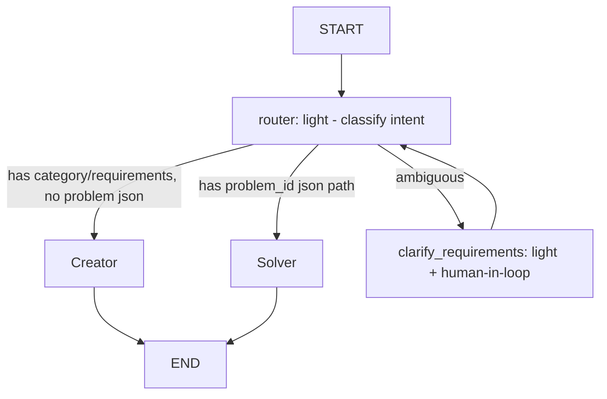
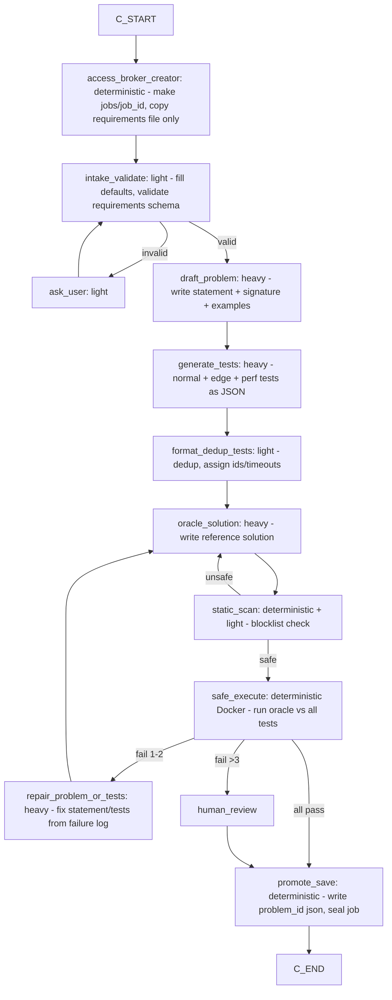
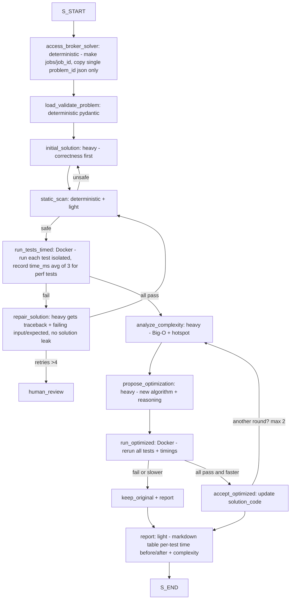

# LeetCode Agent — Full Build Plan (LangGraph + Ollama + Secure Sandbox)

## 1. Objective

Build a local-first LangGraph agent with two modes:

**Mode A - Creator:** Input category / difficulty / requirements -> Output validated `problem_id_xxxx.json` + reference solution verification.

**Mode B - Solver + Optimizer:** Input `problem_id_xxxx.json` -> Output correct solution + per-testcase timing + optimized version with lower time complexity.

Models (Ollama, local):
- Heavy (`gemma3:31b-cloud` — note: user specified `gemma4:31b-cloud`, use exact tag configured in Ollama): problem writing, solution generation, optimization reasoning.
- Light (`deepseek-r1:1.5b`): requirement extraction, classification, static-scan assist, formatting, summarization, routing decisions.

> Verify exact Ollama tags with `ollama list`. If `gemma4:31b-cloud` does not exist, substitute `gemma3:31b` or hosted variant and update `config/models.yaml` in one place.

## 2. Tech Stack

- Orchestration: `langgraph` (StateGraph, conditional edges, subgraphs, checkpointer)
- LLM access: `langchain-ollama` / `ChatOllama` (base_url http://localhost:11434)
- Language: Python 3.11+
- Sandbox: Docker (preferred, foolproof) with fallback to `nsjail`/`firejail` or subprocess + seccomp. No raw `exec()` on host.
- Validation: `pydantic v2` for `ProblemSpec`, `TestCase`, `RunResult`
- Storage: local filesystem `workspace/jobs/<job_id>/` + `workspace/problems/problem_id_xxxx.json`
- Testing: `pytest`
- Observability: LangGraph Studio / langsmith (optional, local logging to JSONL)

## 3. Model Routing Policy (Heavy vs Light)

| Task | Model | Why |
|---|---|---|
| Requirement intake / slot-filling / classification | `deepseek-r1:1.5b` | Fast, cheap, structured extraction |
| Problem statement drafting | `gemma4:31b-cloud` | Needs coherence, examples, constraints |
| Testcase generation (values) | heavy | Needs edge-case reasoning |
| Testcase formatting / dedup | light | Mechanical |
| Oracle / reference solution | heavy | Must be correct |
| Static safety scan (first pass) + regex rules | light + deterministic rules | Speed; rules are source of truth |
| Solver initial solution | heavy | Correctness first |
| Error repair (syntax) | light first, escalate to heavy after 1 fail | Save heavy calls |
| Complexity analysis + optimization proposal | heavy | Algorithmic reasoning |
| Final report summarization | light | Template rendering |

Routing rule: `route(task_complexity, retry_count)`. If `retry_count >= 1` or `task == reasoning-heavy`, escalate to heavy. All LLM calls go through `llm_router.py` with timeout, retry, JSON-mode enforcement.

## 4. File & Workspace Isolation

```
leetcodeagent/
  config/
    models.yaml
    sandbox.yaml         # allowed_imports, timeouts, memory, image
    policies.yaml        # file access scope
  src/
    graph.py             # top-level router graph
    creator_graph.py
    solver_graph.py
    state.py
    llm_router.py
    schemas.py           # pydantic ProblemSpec
    tools/
      access_broker.py
      problem_writer.py
      test_generator.py
      safe_executor.py
      static_scanner.py
      reporter.py
  workspace/
    jobs/<job_id>/       # ONLY dir agent + sandbox see per run
      requirements_id_xxxx.json OR problem_id_xxxx.json
      solution.py
      run_results.json
    problems/
      problem_id_xxxx.json
  Dockerfile.sandbox
```

**Access Broker rules (foolproof):**
1. Every run creates `workspace/jobs/<job_id>/` (uuid).
2. Copy in ONLY ONE file: either `requirements_id_xxxx.json` or `problem_id_xxxx.json`. Nothing else.
3. Agent file tools are scoped: `read_file(path)`, `write_file(path)` validate `realpath(path).startswith(realpath(/jobs/<job_id>/))`. Any `../`, absolute path, symlink escape -> deny + log + fail node.
4. Sandbox container mounts ONLY that job dir to `/work` (rw). Everything else read-only or not mounted. No network (`--network none`).
5. After run, job dir is sealed (read-only) and logged. Problems promoted to `workspace/problems/` only via explicit `promote()` after validation.

JSON naming:
- Input requirements: `requirements_id_<uuid4hex8>.json` e.g. `requirements_id_a1b2c3d4.json`
- Output problem: `problem_id_<slug>_<uuid4hex8>.json` e.g. `problem_id_two_sum_a1b2c3d4.json`

## 5. JSON Schemas (Pydantic = Source of Truth)

### 5.1 `requirements_id_xxxx.json`
```json
{
  "job_id": "req_a1b2c3d4",
  "category": "arrays | dp | graphs | ...",
  "difficulty": "easy | medium | hard",
  "language": "python",
  "num_tests": 8,
  "constraints_hint": "n <= 10^5",
  "extra": "must use O(1) space, etc."
}
```

### 5.2 `problem_id_xxxx.json`
```json
{
  "id": "two_sum_a1b2c3d4",
  "title": "Two Sum",
  "difficulty": "easy",
  "statement": "...",
  "function_name": "two_sum",
  "signature": "def two_sum(nums: list[int], target: int) -> list[int]:",
  "examples": [{"input": {"nums": [2,7,11,15], "target": 9}, "output": [0,1], "explanation": "..."}],
  "constraints": ["2 <= n <= 10^4"],
  "testcases": [
    {"id": "t1", "input": {"nums": [2,7,11,15], "target": 9}, "expected": [0,1], "is_hidden": false, "timeout_ms": 2000},
    {"id": "t_perf", "input": {"nums": [...large...], "target": 99999}, "expected": [...], "is_hidden": true, "timeout_ms": 2000}
  ],
  "oracle_solution_hash": "sha256:... (optional, do not ship solution)"
}
```

Validation: reject if missing fields, duplicate test IDs, non-serializable inputs, `expected` mismatch with oracle run.

## 6. LangGraph Architecture

### 6.1 Top-Level Router Graph



State (`AgentState` TypedDict):
`job_id, mode: creator|solver, requirements_path, problem_spec: ProblemSpec|null, solution_code: str|null, test_results: list[RunResult], timings_ms: dict, attempt: int, errors: list[str], safety_flags: list[str], needs_human: bool`

Checkpointer: `MemorySaver` (dev) / `SqliteSaver` (prod) for resume + audit.

### 6.2 Creator Sub-Graph (Problem Authoring)



Node details:
1. `access_broker_creator`: mkdir, copy single requirements file, return scoped `workdir`.
2. `intake_validate`: light model extracts slots, fills defaults (`num_tests=8`, `language=python`, `timeout_ms=2000`). Deterministic pydantic check.
3. `draft_problem`: heavy, JSON-mode, temp 0.2. Must output full `ProblemSpec` minus testcases.
4. `generate_tests`: heavy, temp 0.4. Prompt: 30% normal, 40% edge (empty/single/dup/negative/max), 30% perf (max-n). Output strictly `list[TestCase]`.
5. `oracle_solution`: heavy, temp 0.0. Only uses `signature`. No access to tests beyond inputs (avoid overfit — run separately).
6. `safe_execute`: see Sec 7. Returns per-test `pass/fail + stdout + time_ms`.
7. `repair_problem_or_tests`: heavy gets `failure_log` (diff expected vs actual, no system paths). Max 3 loops, then human.
8. `promote_save`: compute hash, write to `workspace/problems/problem_id_xxxx.json`, set read-only, append to `registry.jsonl`.

### 6.3 Solver + Optimizer Sub-Graph



Timing method (foolproof):
- Inside container: `time.perf_counter_ns()` around function call only (exclude import).
- Run each test once for correctness, then `perf` tests 3x and average to reduce noise. Report `mean_ms + max_ms`.
- Enforce `timeout_ms` via `timeout` + Docker `--pids-limit 64 --memory 256m --cpus 1`.
- Output table: `test_id | pass | mean_ms | max_ms | vs_baseline_delta`.

Optimization guardrails:
- Only optimize if all tests pass.
- Must preserve `function_name` + signature.
- Max 2 optimization rounds. Keep best correct version (min total time).
- If optimized fails, auto-rollback.

## 7. Secure Sandbox Design (Foolproof)

Dockerfile.sandbox: `python:3.11-slim`, no network tools, non-root user `runner`, only `/work` writable.

Run command template:
```
docker run --rm --network none --cpus 1 --memory 256m --pids-limit 64 \
  --read-only --tmpfs /tmp:rw,noexec,nosuid,size=64m \
  -v /host/workspace/jobs/<job_id>:/work:rw \
  -w /work --user runner sandbox-img \
  timeout 10 python /work/_harness.py
```

`_harness.py` (generated per run, not LLM-editable):
- Loads `solution.py` via `importlib` with restricted `__builtins__`.
- Executes ONLY `function_name(*args)` from testcase `input` dict.
- Deep-compare with `expected` (tolerant for float/order if declared).
- Measures time, catches exceptions, prints JSON line per test to stdout.

**Layered defense:**
1. **Static scan (pre-run, deterministic):** AST parse, deny: `os, sys, subprocess, socket, shutil, pathlib, open(write outside /work), eval, exec, __import__, compile, input, breakpointhook, threading, multiprocessing, ctypes, inspect`. Allowlist imports: `math, heapq, collections, bisect, itertools, functools, typing`. Any `..`, `/`, absolute path string targeting outside `/work` -> block. Light model explains flag, but regex/AST is decision-maker.
2. **Runtime confinement:** seccomp default Docker profile, `read-only` rootfs, 256MB, 1 CPU, no network, `timeout` kill, separate UID, `/work` only mount.
3. **Path jail:** harness resolves all paths, `realpath` must start with `/work`. Symlinks resolved + denied if escaping.
4. **Secrets hygiene:** no env passthrough (`-e` none), no host paths in error messages (sanitize traceback to remove `/host/...`).
5. **Audit:** every run logs `code_hash, static_flags, docker_exit, timings` to `run_results.json` + `audit.jsonl`. Unsafe attempts counted; 3 strikes -> require human approval.

What this blocks: `os.remove()`, `shutil.rmtree('/')`, `open('../../etc/passwd')`, `socket.connect()`, `while True` (timeout), fork bomb (pids-limit), agent reading other jobs (only one mount).

## 8. Prompts & Error Handling Essentials

- All heavy generation uses JSON-mode + pydantic retry (max 2 parse retries via light formatter).
- Never feed full oracle solution to test generator (avoid leakage); never feed hidden expected outputs to solver beyond pass/fail + diff for failing case only.
- Repair prompts include: `failing_test_id, input (truncated if large), expected vs actual (truncated 2000 chars), traceback (sanitized)`. No filesystem paths.
- Human-in-loop interrupts: `clarify_requirements`, `human_review` nodes set `needs_human=True` and pause via checkpointer.

## 9. Build Steps (Order)

1. `schemas.py + example problem_id + requirements_id` + pydantic tests (pytest).
2. `access_broker.py` path-jail tests (try `../`, symlink, absolute — must fail).
3. `static_scanner.py` + unit tests for each blocked pattern.
4. `Dockerfile.sandbox + _harness.py` — manually test timing + timeout + read-only enforcement.
5. `llm_router.py` (Ollama healthcheck, heavy/light selection, JSON enforcement).
6. Creator graph minimal path -> run 2 categories end-to-end.
7. Solver graph minimal path (no optimizer) -> run on created JSON, verify timing table.
8. Optimizer loop + rollback tests.
9. Hardening: fuzz with malicious `solution.py` samples, perf test with n=1e5, registry + audit log.
10. Docs: README run instructions `ollama pull gemma4:31b-cloud`, `ollama pull deepseek-r1:1.5b`, `docker build -f Dockerfile.sandbox .`, `pytest`, `python -m src.graph`.

## 10. Definition of Done / Verification

- Creator: from requirements JSON produces problem JSON that passes oracle run 5/5 times, no unsafe flags.
- Solver: given problem JSON, produces passing solution, per-test timings present, avg variance <15% on rerun for perf test.
- Security: 8/8 malicious samples blocked (delete, rmtree, exfil, network, escape, fork, infinite, import bypass) — document in `security_tests.md`.
- Isolation: agent file tool cannot access outside `jobs/<job_id>/` (pytest proves).
- Optimizer: demonstrates measurable speedup on at least one medium problem (e.g. O(n^2)->O(n)) without breaking tests.

## 11. Risks & Mitigations

- Ollama tag mismatch (`gemma4:31b-cloud`) -> centralize in `models.yaml`, startup check with clear error.
- Small model (`1.5b`) bad JSON -> always pair with deterministic pydantic + retry via heavy fallback.
- Timing noise on Mac/ laptop -> average of 3, pin CPU in Docker, report mean+max.
- LLM overfits to hidden tests -> hide `expected` for hidden tests during solve, only reveal pass/fail until final report.

---
Generated for `leetcodeagent` — single-job workspace isolation + Docker sandbox + dual Ollama routing.
